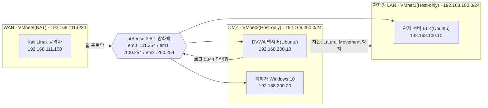

# 3-Tier 웹·네트워크 통합 보안관제 시스템

pfSense 기반으로 WAN / DMZ / 관제망을 존 단위로 분리하고, Default Deny 원칙 위에서 방화벽 정책을 설계한 팀 프로젝트입니다. 이 저장소는 그 중 **방화벽·네트워크 구조 설계** 파트를 정리한 기록입니다.

| 항목 | 내용 |
|---|---|
| 프로젝트 | 3-Tier 웹·네트워크 통합 보안관제 시스템 |
| 소속 | KDT 정보보안 교육과정 팀 프로젝트 (팀 4명) |
| 기간 | 2026.08.01 ~ 2026.08.31 (1개월) |
| 담당 | 방화벽(pfSense) 및 네트워크 존 설계 |
| 환경 | VMware Workstation / pfSense 2.8.1 / VM 5대 |
| 사이트 | https://nht1234.github.io/KDT-3tier-firewall/ |

> 실습 환경 기준입니다. 상용 트래픽이나 실제 운영망 지표가 아니라, 격리된 가상망에서 존 분리와 정책 설계를 직접 구성하고 검증한 결과입니다.

---

## 1. 담당 범위

한 사람이 전부 만든 프로젝트가 아닙니다. 아래 표에서 **본인**으로 표시한 영역만 직접 설계·구축했고, 나머지는 팀원이 담당했습니다. 이 문서는 본인 담당 영역을 중심으로 서술하되, 연동이 필요한 지점은 "팀원이 구축한 ○○와 맞물리도록 설계" 형태로만 언급합니다.

| 영역 | 구성 요소 | 담당 |
|---|---|---|
| 네트워크 구조 | VMnet 존 분리, 고정 IP 체계, pfSense 인터페이스 3장 | **본인** |
| 방화벽 정책 | Default Deny, 존 간 접근 규칙 12개, Alias 설계 | **본인** |
| 경계 탐지 | Suricata (WAN NIDS, IDS 모드) | **본인** |
| 로그 전송 경로 | Filebeat / Syslog 이원화 설계 | **본인** (관제 서버 연동은 팀원과 합의) |
| 관제 서버 | ELK Stack 구축·대시보드 | 팀원 |
| 호스트 탐지 | Snort (DMZ 웹서버 HIDS) | 팀원 |
| 웹 방화벽 | ModSecurity (WAF) | 팀원 |
| 취약 웹앱 | DVWA 구축 | 팀원 |
| 공격 시나리오 | Kali Linux 공격 실습 | 팀원 |

---

## 2. AS-IS → TO-BE

단일 평면망에는 경계가 없습니다. 한 대가 뚫리면 전부 뚫립니다. 이 프로젝트의 출발점은 "왜 존을 나눠야 하는가"였고, 아래가 그 답입니다.

| 항목 | AS-IS (단일 평면망) | TO-BE (3존 분리) |
|---|---|---|
| 망 구조 | 전 장비가 하나의 대역 | 존별 대역·인터페이스 분리 |
| 접근 통제 | 없음, 전체 허용 | Default Deny + 존별 명시 허용 |
| 내부 확산 | 침해 시 무제한 이동 | DMZ → 관제망 차단 (Lateral Movement 방지) |
| 로그 | 장비별 산재 | 관제망으로 단방향 집중 |
| 탐지 | 없음 | 경계·호스트·애플리케이션 3계층 |

---

## 3. 네트워크 설계

존을 나눈다는 것은 대역과 인터페이스를 물리적으로 가른다는 뜻입니다. VMnet 3개를 전부 DHCP 해제하고 전 구간 고정 IP로 고정해, 어떤 장비가 어느 존에 속하는지 IP만 보고 판별할 수 있게 했습니다.



**존 성격**

| 존 | 성격 | 통제 방향 |
|---|---|---|
| WAN | 신뢰하지 않는 구간 | 서비스 포트 외 전면 차단 |
| DMZ | 침해를 전제한 구간 | 관제망으로 나가는 트래픽까지 통제 |
| 관제망 | 로그를 받기만 하는 구간 | 역방향 세션 불허 |

**pfSense 인터페이스**

| 인터페이스 | 존 | IP | VMnet |
|---|---|---|---|
| em0 | WAN | 192.168.111.254 | VMnet8 (NAT) |
| em1 | LAN(관제망) | 192.168.100.254 | VMnet1 (Host-only) |
| em2 | DMZ | 192.168.200.254 | VMnet2 (Host-only) |

> 상세 IP 체계와 VM 5대 구성은 [docs/01-network-design.md](docs/01-network-design.md) 참고.

---

## 4. 방화벽 정책 설계

정책은 규칙 하나하나가 아니라 **평가 순서와 기본 정책**이 보안 수준을 결정합니다. 아래 5가지 원칙을 먼저 세우고 규칙을 채웠습니다.

1. **Default Deny** — 명시적으로 허용하지 않은 트래픽은 전부 차단한다.
2. **First-match 고려한 순서** — pfSense는 위에서 아래로 첫 매치에서 정지한다. Pass는 위, Block은 맨 아래.
3. **Alias로 추상화** — `MON_SERVER`, `DMZ_WEB`, `DMZ_WIN_VICTIM`으로 정의하고, IP를 규칙에 직접 박지 않는다.
4. **모든 Block에 Log** — 차단 자체보다 "무엇이 차단됐는지"가 관제 자산이다.
5. **롤백 안전망 유지** — 초기 Allow-All 규칙을 삭제하지 않고 Disable로 보존한다.

**존 간 접근 정책**

```
WAN  → DMZ    : 웹 서비스 포트만 허용
DMZ  → 관제망 : 로그 전송 포트(5044)만 허용
DMZ  → 내부망 : 전면 차단 (Lateral Movement 방지)
전체 → 관제망 : 로그 트래픽만 단방향
```

**실제 적용 규칙 12개**

WAN 탭 (3개)

| # | Action | Proto | Source → Destination | Port |
|---|---|---|---|---|
| 1 | Pass | TCP | any → DMZ_WEB | 443 |
| 2 | Pass | TCP | any → DMZ_WEB | * |
| 3 | Block | any | any → any | * (Log) |

DMZ 탭 (4개)

| # | Action | Proto | Source → Destination | Port |
|---|---|---|---|---|
| 1 | Pass | TCP/UDP | DMZ net → MON_SERVER | 5044 |
| 2 | Pass | ICMP | DMZ net → DMZ address | * |
| 3 | Block | any | DMZ net → LAN net | * (Log) |
| 4 | Block | any | any → any | * (Log) |

LAN(관제망) 탭 (5개, Anti-Lockout Rule 유지)

| # | Action | Proto | Source → Destination | Port |
|---|---|---|---|---|
| 1 | Pass | TCP | LAN net → This Firewall (self) | 443 |
| 2 | Pass | ICMP | LAN net → This Firewall (self) | * |
| 3 | Pass | TCP | MON_SERVER → any | 443 |
| 4 | Pass | UDP | MON_SERVER → any | 53 |
| 5 | Block | any | any → any | * (Log) |

> 규칙별 설계 근거는 [docs/02-firewall-policy.md](docs/02-firewall-policy.md), 재현용 규칙표·Alias 정의는 [configs/pfsense-rules.md](configs/pfsense-rules.md) · [configs/pfsense-aliases.md](configs/pfsense-aliases.md) 참고.

---

## 5. 다계층 탐지 배치

탐지는 한 곳에 몰지 않고 경계·호스트·애플리케이션 3계층으로 나눴습니다. 본인은 이 중 경계 계층(Suricata)을 담당했습니다.

| 계층 | 수단 | 위치 | 담당 |
|---|---|---|---|
| 1 | Suricata (NIDS) | WAN 경계, pfSense | **본인** |
| 2 | Snort (HIDS) | DMZ 웹서버 | 팀원 |
| 3 | ModSecurity (WAF) | DMZ 웹서버 | 팀원 |

**Suricata를 IDS 모드로 운영한 이유** — 경계에서 먼저 차단(Block Offenders)해 버리면, 뒤에 있는 호스트·애플리케이션 계층의 탐지 성능을 검증할 수 없습니다. 다계층 탐지가 실제로 겹겹이 작동하는지 확인하는 것이 이번 실습의 목적이었기 때문에, 경계는 탐지만 하고 통과시키도록 IDS 모드로 뒀습니다.

- 룰셋: ETOpen Emerging Threats — `emerging-scan` / `dos` / `exploit` / `web_server`

> Suricata WAN 설정값과 룰셋 선정 근거는 [configs/suricata-wan.md](configs/suricata-wan.md) 참고.

---

## 6. 로그 전송 경로 설계

관제망은 로그를 받기만 하는 구간입니다. 문제는 로그를 보내는 장비의 OS가 서로 달랐다는 점입니다.

| 출발지 | OS | 전송 방식 | 목적지 포트 | 사유 |
|---|---|---|---|---|
| DVWA (Snort) | Ubuntu | Filebeat | 5044 (beats) | 리눅스, 정식 지원 |
| pfSense (Suricata) | FreeBSD | Syslog | 5140 (syslog) | Filebeat 미지원 |

pfSense는 FreeBSD 기반이라 리눅스용 Filebeat를 설치할 수 없습니다. 플랫폼 제약을 억지로 우회하는 대신 인정하고, 전송 경로를 이원화했습니다. 관제 서버 Logstash에 입력 2개를 여는 것으로 팀원과 합의했습니다.

> 이원화 판단 근거와 경로별 설정은 [docs/03-log-pipeline.md](docs/03-log-pipeline.md) 참고.

---

## 7. 검증

규칙을 넣는 것으로 끝내지 않고, 실제 트래픽으로 의도대로 동작하는지 확인했습니다.

```bash
curl http://192.168.200.10     # 302 Found → 웹 포트 허용 확인
nmap -sS 192.168.200.10        # 80/tcp open, 나머지 filtered
ping 192.168.200.10            # 무응답 (ICMP 미허용, 정상)
```

검증 항목 7개 전부 통과했습니다.

| # | 항목 | 기대 결과 |
|---|---|---|
| 1 | WAN → DMZ 웹 포트 | 허용 |
| 2 | WAN → DMZ 그 외 포트 | filtered |
| 3 | WAN → DMZ ICMP | 차단 |
| 4 | DMZ → 관제망 5044 | 허용 |
| 5 | DMZ → 관제망 그 외 | 차단 + 로그 |
| 6 | DMZ → LAN net | 차단 + 로그 |
| 7 | 차단 트래픽 로그 적재 | 확인 |

**핵심 판단 기준: `closed`가 아니라 `filtered`** — nmap이 `closed`를 반환하면 방화벽이 RST를 돌려준 것이고, `filtered`를 반환하면 조용히 드롭했다는 뜻입니다. 후자여야 외부에서 포트의 존재 여부조차 알 수 없습니다.

> 검증 절차 전체와 항목별 결과는 [docs/04-verification.md](docs/04-verification.md) 참고.

---

## 8. 트러블슈팅

구축 중 총 13건을 해결했습니다. 그 중 배운 점이 분명했던 3건을 아래에 요약합니다.

**① WAN 게이트웨이조차 닿지 않음 — 어댑터 오결선**
Kali의 WAN IP가 DMZ에 물린 `eth1`에 할당돼 있었습니다. 방화벽 규칙을 계속 고치는 대신, 양끝에서 가능성을 지워 나가며(방화벽 생존 확인 → pfSense WAN 정상 확인 → 남은 Kali) 원인을 좁혔습니다. L3 설정이 맞아도 L1·L2가 어긋나면 의미가 없습니다.

**② DMZ 서버에서 게이트웨이 ping 실패 — net vs address**
DMZ 규칙의 Source를 `DMZ address`로 지정한 것이 원인이었습니다. 이건 pfSense 자신의 DMZ 인터페이스 IP 한 개(/32)를 뜻하고, DMZ 안 서버에서 나가는 트래픽은 매칭되지 않습니다. `DMZ net`(대역 전체)으로 바꿔 해결했습니다. UI의 한 단어가 /32와 /24를 가릅니다.

**③ 관제 서버 → pfSense 단방향 불통 — self 규칙 누락**
LAN 규칙을 최소 권한으로 좁히면서, pfSense 자기 자신(self)으로 향하는 ICMP·443 허용이 빠져 있었습니다. 정책을 조이는 작업은 관리 경로까지 잠글 위험을 늘 동반한다는 것을 확인했습니다.

> 3건 상세(증상 / 원인 격리 / 조치 / 배운 점)와 나머지 10건 요약은 [docs/05-troubleshooting.md](docs/05-troubleshooting.md) 참고.

---

## 9. 배운 점 · 향후 과제

**배운 점**

- **정책은 순서가 곧 논리다** — 규칙 하나하나보다 평가 순서와 기본 정책이 보안 수준을 결정했다.
- **차단보다 기록이 자산이다** — 모든 Block에 로그를 붙인 덕분에 차단 시도 자체가 분석 대상이 됐다.
- **장애는 배제로 좁힌다** — 증상을 보고 설정을 바꾸는 대신 양끝에서 가능성을 지워 나갔다.

**향후 과제**

- **오탐 튜닝** — ETOpen 기본 룰셋을 그대로 사용 중. 실제 트래픽 기준 Suppress 리스트를 구성한다.
- **IDS → IPS 전환** — 탐지 신뢰도를 확보한 뒤 Block Offenders를 단계적으로 적용한다.
- **규칙 형상관리** — 현재 GUI 수동 설정. 규칙 export를 버전 관리해 변경 이력을 추적한다.
- **관제망 암호화** — 격리망이라 평문 전송. 실 환경 기준 TLS를 적용한다.

---

## 10. 사용 기술 · 연락처

**사용 기술**

- 방화벽 / 네트워크: pfSense 2.8.1, VMware Workstation, Static IP, NAT/Host-only
- 탐지: Suricata (NIDS, IDS 모드), ETOpen Emerging Threats 룰셋
- 로그: Filebeat, Syslog (Logstash 입력 연동)
- 검증: nmap, curl, ping, ARP

**연락처**

- Email: nht1234dk@gmail.com
- 상세 기록(Notion): https://app.notion.com/p/3-Tier-3db35b674779812490f8ebee99b38e26
- 포트폴리오 사이트(GitHub Pages): https://nht1234.github.io/KDT-3tier-firewall/
