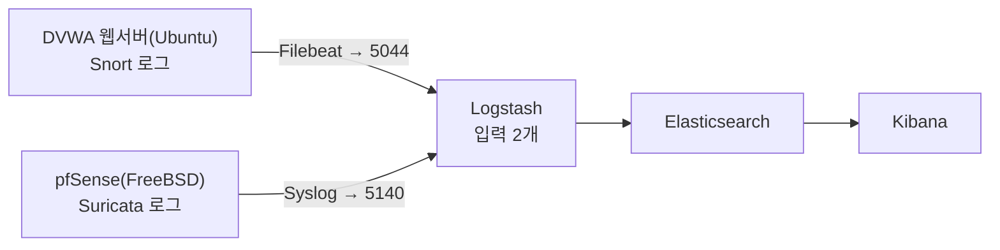

[← README로 돌아가기](../README.md)

# 03. 로그 전송 경로 설계

## 결론

로그를 보내는 두 장비의 OS가 서로 달라, 단일 전송 방식으로 통일할 수 없었습니다. 억지로 우회하는 대신 플랫폼 제약을 인정하고 전송 경로를 이원화했습니다.

## 근거

관제망은 로그를 받기만 하는 구간입니다(단방향 집중). 문제는 출발지 장비의 OS입니다.

- DVWA 웹서버는 **Ubuntu(리눅스)** — Filebeat가 정식 지원됩니다.
- pfSense는 **FreeBSD** 기반 — 리눅스용 Filebeat를 설치할 수 없습니다.

FreeBSD에 억지로 Filebeat를 얹으려 시간을 쓰는 것보다, pfSense가 원래 지원하는 Syslog 전송을 쓰는 편이 안정적입니다. 그래서 경로를 둘로 나눴습니다.

## 이원화 설계

| 출발지 | OS | 전송 방식 | 목적지 포트 | 사유 |
|---|---|---|---|---|
| DVWA (Snort) | Ubuntu | Filebeat | 5044 (beats) | 리눅스, 정식 지원 |
| pfSense (Suricata) | FreeBSD | Syslog | 5140 (syslog) | Filebeat 미지원 |

## 팀원과의 합의

관제 서버(Logstash) 쪽에서 입력을 2개 여는 것으로 팀원과 합의했습니다. 본인은 **어느 장비가 어느 포트로 무엇을 보내는지**(전송 경로·포트·프로토콜)를 확정해 전달했고, Logstash 파이프라인 구성과 ELK 대시보드는 팀원이 담당했습니다.

- 5044(beats): 리눅스 계열 Filebeat 입력
- 5140(syslog): pfSense Syslog 입력

> 포트 5044 허용은 방화벽 DMZ 탭 1번 규칙에 반영돼 있습니다. [docs/02-firewall-policy.md](02-firewall-policy.md) 참고.

## 한계

격리 실습망이라 로그를 평문으로 전송했습니다. 실 환경에서는 전송 구간에 TLS를 적용해야 합니다(향후 과제 참고).
